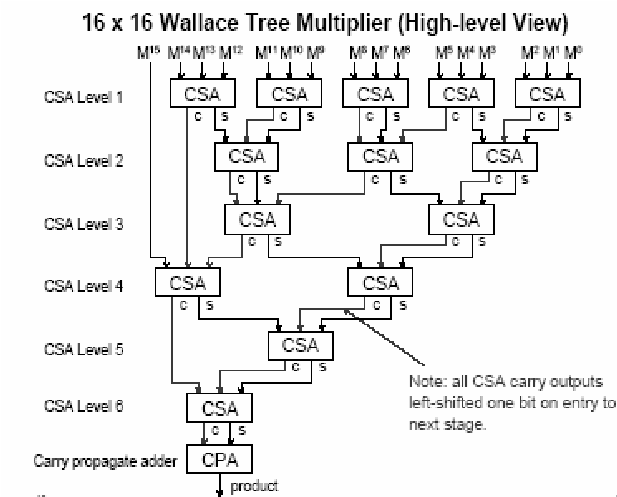

## 32-bit Radix-4 Booth Encoded Wallace Tree Multiplier 
---
This repository presents a 32 bit **Radix-4 Booth Encoded Wallace Tree Multiplier**
described in Verilog HDL and synthetized for a Artix-7 FPGA, xc7a50tcsg324-3, 
using Vivado Design Suite 25.1.

---
## Architecture
The multiplier consists of:
- **Booth Encoding (Radix-4)** – Efficient partial product generation  
- **Wallace Tree (Carry-Save Adder Tree)** – Fast partial product reduction  
- **Final Carry-Propagate Adder (CPA)** – Configurable as:  
  - **Carry-Lookahead Adder (CLA)** (Area-efficient)  
  - **Kogge-Stone Adder (KSA)** (Faster but more power/area-intensive)
  - **Knowles Adder (KA)** (Slower than Kogge but a little smaller)  
- The **Wallace Tree** using CSAs is essentially the same as a 16x16 multiplier,
as shown in:

---
## Features  
- **Booth Radix-4 Algorithm** – Reduces partial products by half  
- **Wallace Tree Compression** – Optimized for fast multiplication  
- **Parametrized Final Adder** – Choose between CLA (balanced) or Parallel Prefix Adders (high-speed)  
---
## Contact

For questions or feedback, feel free to reach out:

- **Email**: d2022004055@unifei.edu.br
- **GitHub**: [JASLemos](https://github.com/JASLemos)
---
